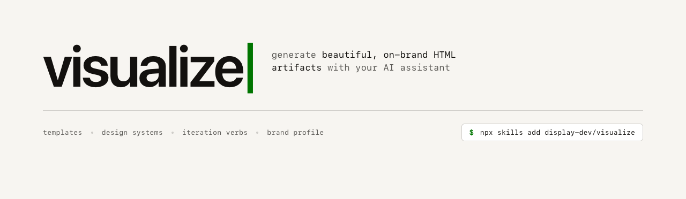
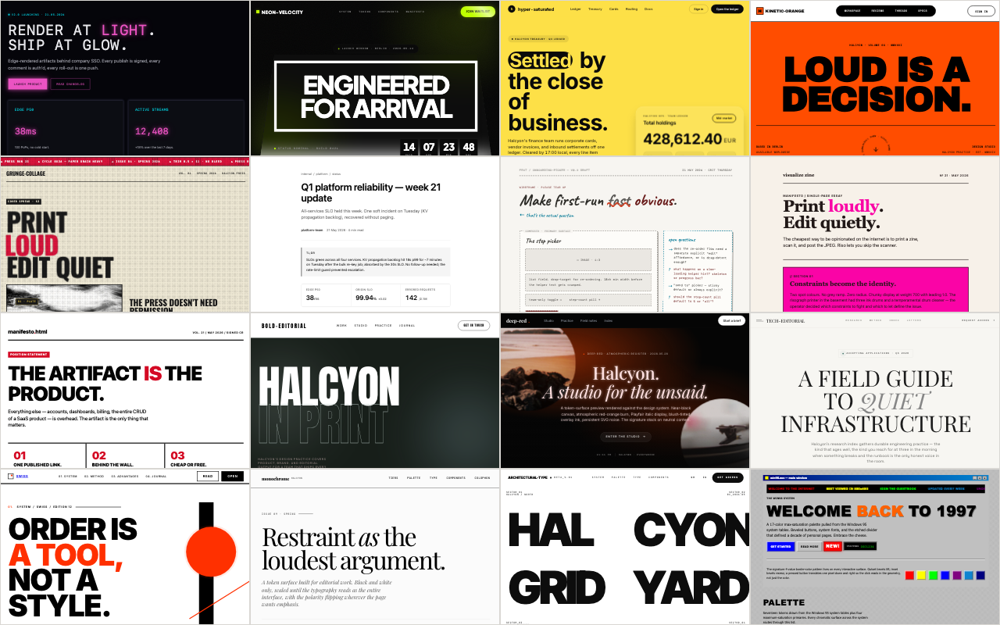
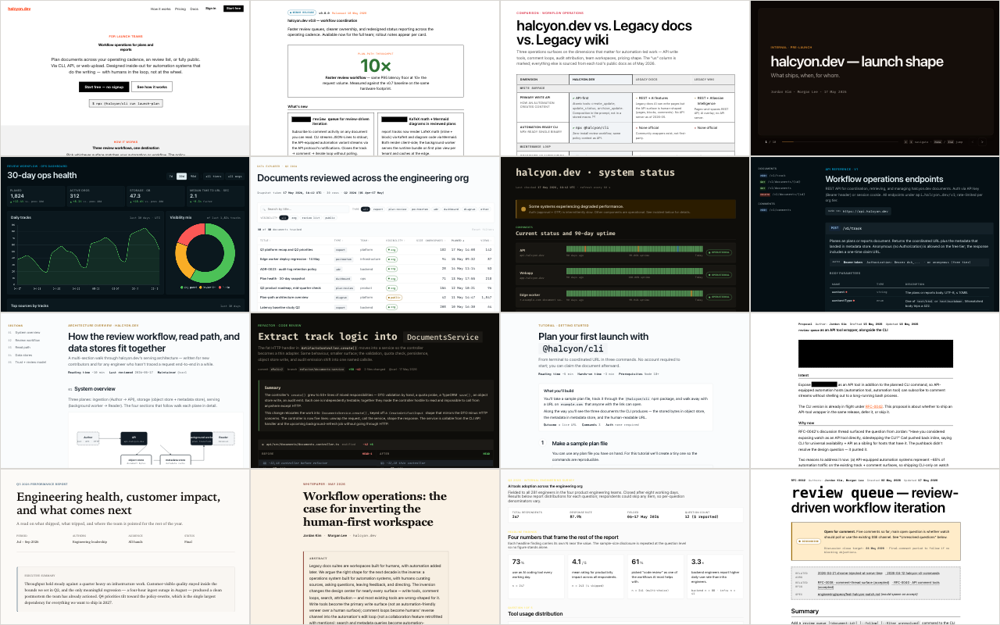

<p></p>

# visualize

**Generate beautiful, on-brand HTML — without the AI-default slop.**

Agents already generate HTML when you ask. Reports, diagrams, dashboards, slide decks, plans, recaps. The output works, but it looks the same everywhere: Inter font, purple gradients, cards in cards, generic shadcn defaults that read as "this was generated by an agent." visualize closes that gap.

## Install

```sh
npx skills add display-dev/visualize --skill visualize
```

Works across Claude Code, Cursor, Codex, OpenCode, Hermes, and Pi.

## Why visualize?

Four problems with how agents publish HTML today:

**1. Every artifact looks the same.** Every coding agent was trained on the same SaaS templates: Inter for everything, purple-to-blue gradients, rounded-square icon tile above every heading, six metric cards in a row, "Get started for free" CTA. Skip the brand guidance and every Report reads as the same Report. A Report from your company should look like your company's Report; today it looks like a generic shadcn demo regardless of who shipped it.

**2. No brand context.** Pasting brand colors into every prompt isn't sustainable, and the agent forgets between sessions. visualize captures voice + visual identity once via `teach`, then every render reads the brand profile and produces a Report that visibly belongs to your company.

**3. Compare real directions before choosing.** `explore artifact` compares structure, visual treatment, or both in one self-contained HTML review. Content, facts, assets, actions, and non-overridden project choices stay fixed. Switch between wide and 390 px states, scroll each full document normally, and choose before the target changes. Apply a named reference theme directly when the direction is already chosen.

**4. Iteration verbs with real contracts.** visualize has five Refine verbs (`simplify`, `bolder`, `quieter`, `animate`, `polish`) plus one Evaluate verb (`review`). Each does one specific thing — `bolder` amplifies visual punch, `simplify` strips decoration, `quieter` tones intensity, `animate` covers motion, `polish` is the terminal quality pass the other Refine verbs hand off to. `review` reports findings without modifying the file.

## What's inside

<p></p>

### Templates — 35 across 7 categories

<p></p>

| Category | Templates |
|---|---|
| Explanation / reference | explainer · diagram · architecture-overview · implementation-plan · diff-review · plan-review · project-recap · fact-check-report · comparison · faq |
| Status / tracking | dashboard · roadmap-timeline · changelog · status-page · release-announcement |
| Decision / narrative | adr · rfc · postmortem · proposal |
| Long-form | report · whitepaper · case-study · research-brief |
| Instructional | runbook · onboarding-module · meeting-notes · tutorial · api-reference |
| Data-shaped | data-explorer · survey-results |
| Presentation / marketing | slide-deck · pitch-deck · one-pager · org-chart · resume-bio |

### Design systems and artifact themes

Reference packages with visual guidance, tokens, and previews. Use them when deriving a project identity with `teach`, apply one as an artifact theme, or compare treatments with `explore artifact`. Two layers:

- **40 native register-family references** — Clean (default), Editorial, Console, IDE, Terminal, Blueprint, Brutalist, Deck, Paper-ink, Whitepaper, plus broader artifact registers like Bento, Neon, Riso, Terracotta, Glassmorphism, Dithered, Luxury, Sketch, Monograph, News-print, Swiss, Win98, and more.
- **63 brand-style entries** — `airbnb-style`, `apple-style`, `cohere-style`, `mistral-ai-style`, etc. All brand-style entries are self-authored from live brand verification and carry `source: live-verified` in their `DESIGN.md` frontmatter.

Each design system has `DESIGN.md` for visual guidance and `tokens.css` for concrete values. A package README, when present, links its references and previews; see [Editorial](visualize/design-systems/editorial/README.md).

For example: “Apply Editorial to this report. Replace the project's visual styling for this artifact only; keep its logo, content, section order, and behavior.”

Project styling remains the default. Explicit artifact overrides stay local and do not change project design files. A named treatment can be applied directly; `explore artifact` compares structure, visual treatment, or both before selection. A new artifact does not need an existing layout or captured project profile.

### Iteration verbs — 6 commands that operate on existing artifacts

| Verb | What it does |
|---|---|
| `polish` | Alignment, spacing, consistency, edge data shapes |
| `review` | Deterministic detector findings + LLM judgment |
| `simplify` | Strip decoration that isn't earning its pixel |
| `bolder` | Amplify visual punch |
| `quieter` | Tone down over-decoration |
| `animate` | Purposeful motion, `prefers-reduced-motion` compliant |

### Brand profile — `teach` captures once, every artifact reads

`/visualize teach` bootstraps once per project. The flow walks the codebase, captures the live site, reads existing artifacts, and asks for the missing pieces. It writes two files at the project root:

- **`DESIGN.md`** — Google Stitch's canonical format. YAML frontmatter carrying machine-readable design tokens (colors / typography / radius / components in shadcn-semantic shape) + a six-section markdown body (Overview / Colors / Typography / Elevation / Components / Do's and Don'ts) that carries the affordance vocabulary.
- **`PRODUCT.md`** — voice, audience, tone, register.

A sibling `tokens.css` at the project root carries the CSS-form tokens templates read at render time.

### Deterministic artifact checks

Color choices follow the brief and approved identity, not blanket hue bans: neutral gray, red primaries, multiple accents, and restrained or immersive color are valid. The shared [color guidance](visualize/reference/color.md) explains character, roles, and focused comparisons; contrast and non-color cues remain requirements.

`scripts/detect.mjs` runs rules across six categories: **fossil** (lorem ipsum, citation tokens, "Generated by AI" disclaimers), **slop** (gradient text, crushed tracking, nested cards, section scaffolding, provider-specific tells), **diagram** (semantic topology, groups, accessibility, and delivered SVG), **a11y** (contrast, headings, alt text), **meta** (title, social previews, external scripts), **perf** (image size, animation cost). Used by `/visualize review`; usable standalone:

```sh
node scripts/detect.mjs --strict artifact.html
node scripts/detect.mjs --json --brand DESIGN.md artifact.html
node scripts/detect.mjs --provider codex artifact.html
node scripts/detect.mjs --list-rules
```

Relationship diagrams route by reader question into flow, system, sequence, state/lifecycle, hierarchy, or simple spatial grammar. Delivered figures are self-contained semantic inline SVG: Mermaid may calculate an initial layout locally, but no Mermaid runtime or network dependency ships.

Use the pinned authoring helper to turn Mermaid source into a draft SVG, then inline and semantically normalize that SVG before delivery:

```sh
node scripts/render-mermaid.mjs source.mmd draft.svg
```

`scripts/browser-diagram.mjs` checks marked diagrams at desktop and 390 px widths in explicit light and dark themes. It blocks and reports non-allowlisted external network requests, then reports clipping, peer and label overlap, paths through unrelated nodes, edge intersections or stacking, distant endpoints, computed contrast, and extreme aspect ratios using the same structured severities as the static detector:

```sh
node scripts/browser-diagram.mjs --strict artifact.html
node scripts/browser-diagram.mjs --self-test
```

### Portable image generation

The portable contract can create one local PNG or JPEG through an explicitly selected released route. It preserves provider bytes, reports ordinary route/output diagnostics, and requires the active agent to open and visually inspect the image before using it. Ambiguous attempts stop without retry or fallback.

See [`visualize/reference/image-generation.md`](visualize/reference/image-generation.md) for the canonical route, limits, billing, validation, and recovery contract. [`HARNESSES.md`](HARNESSES.md) records only current observed host and route evidence; routes without that evidence remain maintainer candidates.

## Commands

`/visualize` invokes the skill. The argument tells the agent what to do.

| Form | Effect |
|---|---|
| `/visualize <topic-or-path>` | Pick template from intent; compose against brand tokens; write self-contained HTML |
| `/visualize teach` | Bootstrap (or refresh) the brand profile |
| `/visualize explore artifact <topic-or-path>` | Compare structure, visual treatment, or both for one artifact |
| `/visualize polish <path>` | Iteration: alignment, spacing, consistency |
| `/visualize review <path>` | Iteration: detector findings + LLM judgment |
| `/visualize simplify <path>` | Iteration: strip decoration |
| `/visualize bolder <path>` | Iteration: amplify visual punch |
| `/visualize quieter <path>` | Iteration: tone down |
| `/visualize animate <path>` | Iteration: purposeful motion |
| `/visualize publish <path>` | Publish the artifact to a hosting destination via MCP, CLI, or HTTP |

On Claude Code the form is space-separated: `/visualize teach`. Other hosts (Cursor, Codex, Copilot, OpenCode, Gemini, Claude.ai) load on intent-match from natural language. Phrasings like "create a plan," "make me a diagram," "polish this report," or "use my brand" trigger the skill without an explicit slash.

## License

MIT — see [LICENSE](./LICENSE). Bundles [jq 1.7.1](https://github.com/jqlang/jq) (MIT, © 2012 Stephen Dolan); full text in [`visualize/bin/jq.LICENSE`](visualize/bin/jq.LICENSE).
